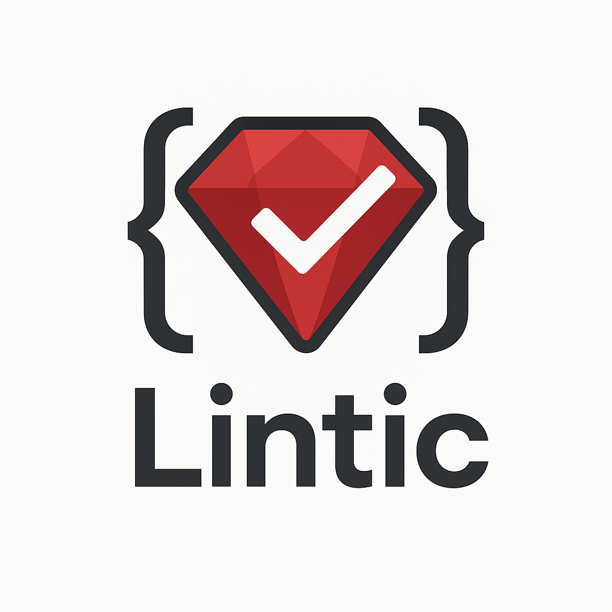

<div align="center">



# 🩺 Lintic

**A medic for linting errors**

<p align="center">
  <strong>Automatically detect and fix RuboCop linting violations in your pull requests using AI-powered corrections.</strong><br>
  <em>Never worry about CI failures due to linting errors again!</em>
</p>

<p align="center">
  
  
  
  
</p>

<p align="center">
  <a href="https://www.ruby-lang.org/">
    
  </a>
  <a href="action.yml">
    
  </a>
  
</p>

---

</div>

## Purpose

Tired of having your CI fail due to RuboCop linting errors after you've already pushed your code? **Lintic** solves this problem by automatically detecting linting violations in your pull requests and creating fix PRs with AI-powered corrections.

## How It Works

When Lintic runs on a pull request:

1. **🔍 Analyzes** - Fetches and analyzes all Ruby files (`.rb`) in the PR
2. **🔧 Lints** - Runs RuboCop to detect linting violations
3. **🤖 Fixes** - Uses AI (configurable models via Ollama/OpenAI) to intelligently fix the errors
4. **📝 Summarizes** - Generates detailed summaries of what was changed and why
5. **🚀 Creates PR** - Opens a new pull request with the fixes that you can merge into your feature branch

The AI focuses only on the changed lines in your PR (shown in the diff) to avoid unnecessary modifications to existing code.

## Features

- **🎯 Smart Targeting**: Only fixes linting errors in the actual changes you made
- **🧠 AI-Powered**: Uses advanced language models to understand context and make intelligent fixes
- **📊 Detailed Reports**: Provides clear summaries of what was fixed and why
- **🔄 Automated Workflow**: Integrates seamlessly with GitHub Actions
- **⚡ Fast**: Processes only the files that changed in your PR
- **🛡️ Safe**: Creates separate PRs for fixes, so you can review before merging

## Quick Start

### As a GitHub Action (Recommended)

Add this to `.github/workflows/lintic.yml`:

```yaml
name: Lintic

on:
  pull_request:
    paths:
      - '**/*.rb'

jobs:
  lint-fix:
    runs-on: ubuntu-latest
    if: github.event.pull_request.head.repo.full_name == github.repository

    steps:
      - uses: actions/checkout@v4

      - name: Fix linting errors with Lintic
        uses: shindi-renuo/lintic@main
        with:
          github-token: ${{ secrets.GITHUB_TOKEN }}
          ollama-model: qwen2.5-coder:1.5b
          ollama-uri: http://localhost:11434/v1/
          openai-api-key: 'ollama'
```

> 📖 For detailed setup instructions, configuration options, and troubleshooting, see [CI_SETUP.md](CI_SETUP.md).

### Local Development

1. **Clone and setup:**
   ```bash
   git clone https://github.com/shindi-renuo/lintic.git
   cd lintic
   bundle install
   ```

2. **Install and start Ollama:**
   ```bash
   # Install Ollama from https://ollama.ai/
   ollama pull qwen2.5-coder:1.5b  # or codellama
   ```

3. **Configure environment:**
   ```bash
       # Create .env file
    cat > .env << EOF
    LINTIC_GITHUB_TOKEN="ghp_YOUR_TOKEN"
    LINTIC_GITHUB_REPO="owner/repository-name"
    LINTIC_GITHUB_PR_NUMBER="123"
    LINTIC_MODEL="qwen2.5-coder:1.5b"
    LINTIC_URI="http://localhost:11434/v1/"
    LINTIC_OPENAI_API_KEY="ollama"
    EOF
   ```

4. **Run:**
   ```bash
   ruby main.rb
   ```

## Configuration

### Environment Variables

| Variable | Required | Default | Description |
|----------|----------|---------|-------------|
| `LINTIC_GITHUB_TOKEN` | ✅ | - | GitHub Personal Access Token with `repo` scope |
| `LINTIC_GITHUB_REPO` | ✅ | - | Repository in format `owner/repo-name` |
| `LINTIC_GITHUB_PR_NUMBER` | ✅ | - | Pull request number to process |
| `LINTIC_MODEL` | ❌ | `codellama` | AI model to use for fixes |
| `LINTIC_URI` | ❌ | `http://localhost:11434/v1/` | Server endpoint for AI model |
| `LINTIC_OPENAI_API_KEY` | ❌ | `ollama` | API key (use 'ollama' for local Ollama) |

### Supported AI Models

- **Ollama (Recommended)**: `qwen2.5-coder:1.5b`, `codellama`, `deepseek-coder`
- **OpenAI**: `gpt-4`, `gpt-3.5-turbo` (requires valid API key)

## GitHub Action Inputs

| Input | Required | Default | Description |
|-------|----------|---------|-------------|
| `github-token` | ✅ | `${{ github.token }}` | GitHub token for API access |
| `ollama-model` | ❌ | `qwen2.5-coder:1.5b` | AI model to use |
| `ollama-uri` | ❌ | `http://localhost:11434/v1/` | Ollama server URI |
| `openai-api-key` | ❌ | `ollama` | OpenAI API key |
| `ruby-version` | ❌ | `3.1` | Ruby version to use |

## Example Output

When Lintic finds and fixes linting errors, it creates a PR like this:

```
[LINTIC] 🧹 Fix linting errors (PR #123)

🤖 Automated Linting Fixes

This PR was automatically created by Lintic to fix linting errors found in PR #123.

### What was fixed:
### app/models/user.rb
- Fixed line length violations by breaking long method chains
- Added missing frozen_string_literal comment
- Corrected indentation for method definitions
- Replaced single quotes with double quotes for consistency

### How to use:
1. Review the changes in this PR
2. If satisfied, merge this PR into your feature branch
3. Your original PR will then have clean, linted code
```

## Dependencies

- **Ruby** 3.0+
- **RuboCop** (for linting)
- **Octokit** (GitHub API)
- **ruby-openai** (AI integration)
- **Ollama** (for local AI models)

## Error Handling

Lintic includes comprehensive error handling:
- **GitHubError**: Issues with GitHub API access
- **LintingError**: Problems running RuboCop
- **AIError**: AI model failures
- **LinticError**: General Lintic errors

All errors are logged with detailed messages and appropriate exit codes for CI integration.

## Contributing

1. Fork the repository
2. Create your feature branch (`git checkout -b feature/amazing-feature`)
3. Commit your changes (`git commit -m 'Add some amazing feature'`)
4. Push to the branch (`git push origin feature/amazing-feature`)
5. Open a Pull Request

## License

This project is licensed under the MIT License - see the [LICENSE](LICENSE) file for details.

---

<div align="center">
  <strong>Built with ❤️ by the Sami Hindi @ Renuo</strong><br>
  <em>Never worry about linting errors in CI again! 🚀</em>
</div>
